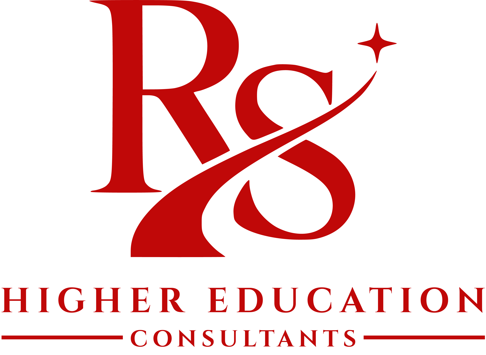

# Consultancy Website

A modern and responsive consultancy website designed to provide professional consultancy services and information to clients.

## About the Project

This website is developed for a consultancy business to present its services, company information, and contact details through a clean and professional web interface.

The website is designed with a focus on:

- Professional and modern UI
- Responsive design for all screen sizes
- Clear presentation of consultancy services
- Company and business information
- Easy navigation
- Contact and inquiry functionality
- Fast and user-friendly experience

## Services

The website provides information about the consultancy services offered by the business and helps visitors understand the available services and how to get in touch.

## Technologies Used

- React.js
- Vite
- Tailwind CSS
- JavaScript / TypeScript
- HTML5
- CSS3

## Project Structure

The project follows a modern React-based structure with reusable components, assets, and responsive layouts.

## Purpose

The main purpose of this project is to provide a professional online presence for the consultancy business and make its services easily accessible to potential clients.

## License

This project is developed for the consultancy business.
